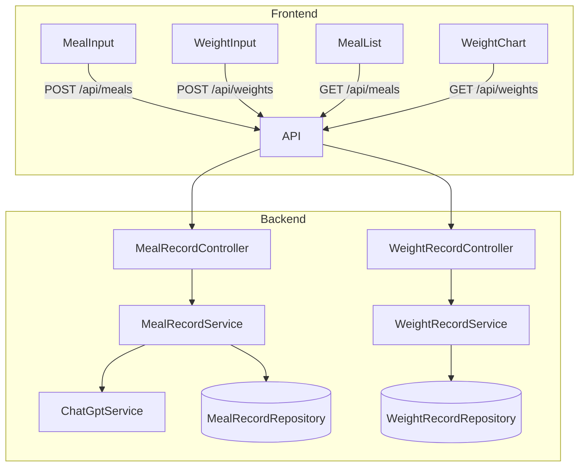
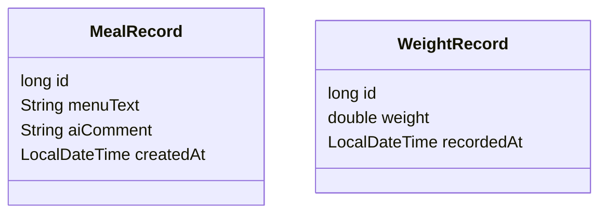

# TubuhBaru

TubuhBaru is a monorepo health management application using Vue 3 and Spring Boot.

## Structure

- `frontend/` - Vue 3 project powered by Vite.
- `backend/` - Spring Boot (Java 17) backend API.

## Data Flow



## Data Model



## Development

### Backend

```bash
cd backend
mvn spring-boot:run
```

The backend exposes:

- `GET /api/hello` – simple hello API returning a JSON message.
- `POST /api/meals` – accepts a JSON body with `menuText`.
- `POST /api/weights` – accepts `weight` and `recordedAt` as JSON.

### Frontend

```bash
cd frontend
npm install # install dependencies
npm run dev
```

The frontend includes a `MealInput` component that posts to `/api/meals`.
It also provides a `WeightInput` component for sending weights to `/api/weights`.

### Running Tests

Backend tests can be run with Maven:

```bash
cd backend
mvn test
```
